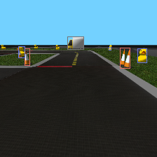
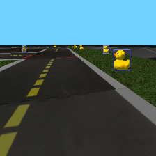
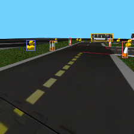
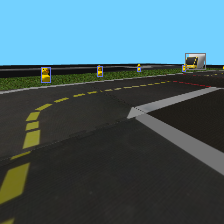
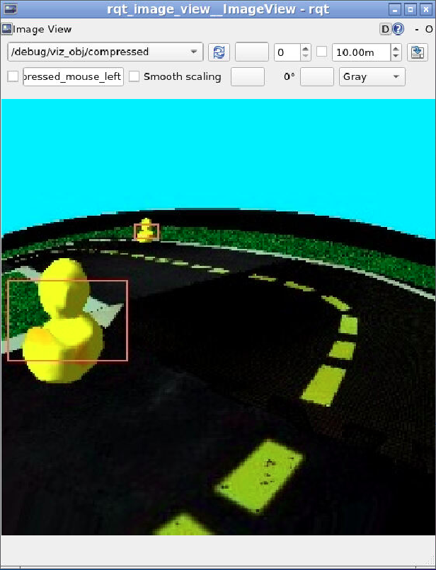
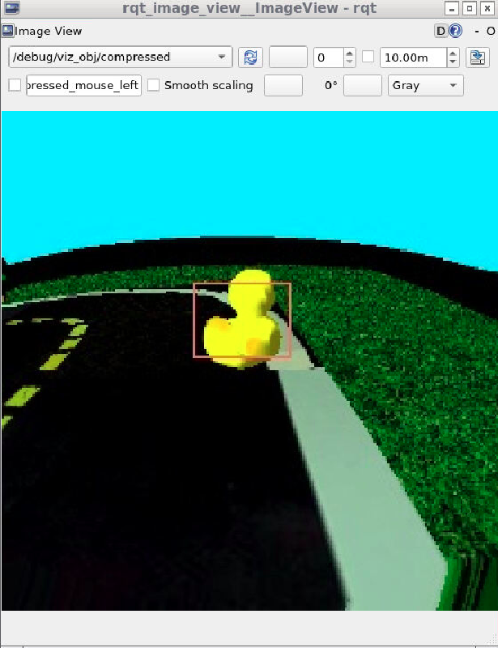
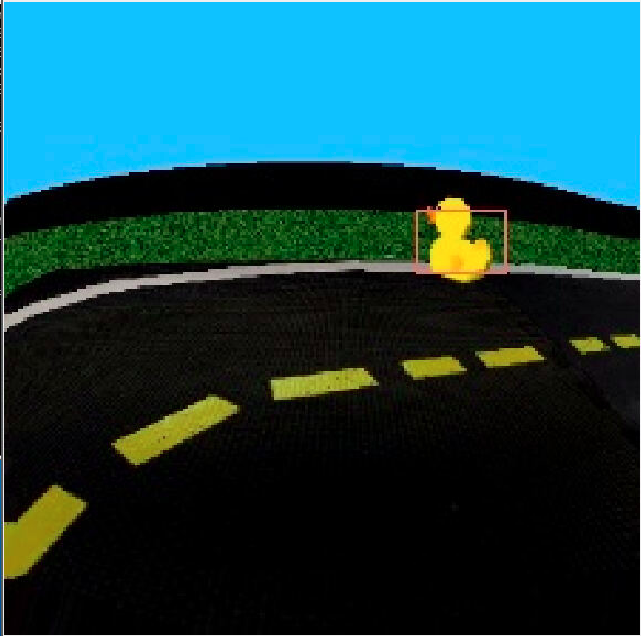

### Sample Generated Training Data

### Link to full training data (2500 images)
https://drive.google.com/file/d/1O6Q3387JoMBHQZaPf_KKm3J4iOJwsuVX/view?usp=sharing

### Inference Screenshots from RQT Image View

### Link to video
https://drive.google.com/file/d/1QjFBIyuGMmzbD6CZ6IPb96py3uEUBQGd/view?usp=sharing

### Link to Google Colab notebook used for training
https://colab.research.google.com/drive/1JbBEsZsQNf0P8sH_M9sKFIxXloImLJb8?usp=sharing